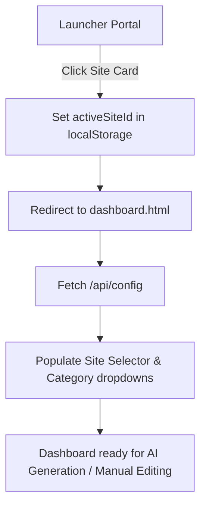

# Frontend Integration Specification Guide: Novox Blog Admin Studio

This document contains the specifications required to design and build an independent frontend client for the **Novox Blog Admin Studio** backend microservice. 

---

## 1. UI Architecture & User Flow

The client interface is divided into two primary screen workflows:
1.  **Workstation Launcher Portal:** An initial landing page where the user selects which website codebase layout profile they want to manage.
2.  **Blog Workstation Dashboard:** A split-screen environment containing form controls (left sidebar), code editor and live styled preview simulator (center pane), and a live SEO verification engine (right sidebar).

### 📐 Workspace Transitions Diagram


---

## 2. API Contract & Payload Data Structures

All requests to the backend should be relative to the server host (defaulting locally to `http://localhost:3003`). 

> [!NOTE]
> Authentication has been bypassed. You do **not** need to send authorization tokens in headers unless you decide to re-implement them.

### API Endpoint Map

| Endpoint Path | Method | Headers | Description |
| :--- | :--- | :--- | :--- |
| `/api/config` | `GET` | | Returns all configured site profiles and target repositories. |
| `/api/blogs` | `GET` | `x-site-id` | Returns metadata arrays of existing blog files on GitHub. |
| `/api/blogs/:filename` | `GET` | `x-site-id` | Retrieves single parsed HTML content body + SEO metadata. |
| `/api/generate` | `POST` | `x-site-id` | Generates article body using Gemini and cover using Imagen. |
| `/api/generate-image-only`| `POST` | | Regenerates WebP Cover banner only. |
| `/api/publish` | `POST` | `x-site-id` | Validates, compiles templates, and pushes commits to GitHub. |
| `/api/blogs/:filename/delete` | `POST` | `x-site-id` | Deletes article and cleans references on GitHub. |
| `/api/blogs-image` | `GET` | `x-site-id` | Proxies binary image streams from private repos/LFS storage. |

---

### Request & Response Payloads

#### 1. GET `/api/config`
**Response (200 OK):**
```json
{
  "novox_edtech": {
    "displayName": "Novox Edtech",
    "categories": [
      { "name": "Software Development", "url": "software-development-courses-in-kochi.html" }
    ],
    "seo": {
      "headingTag": "h2",
      "subheadingTag": "h3",
      "requireFaq": true,
      "requireConclusion": true,
      "ctaClass": "blog-details-cta",
      "ctaAnchorClass": "tp-btn-3"
    }
  },
  "novox_core": { ... }
}
```

#### 2. GET `/api/blogs`
Requires `x-site-id` in the header (e.g., `novox_edtech`).
**Response (200 OK):**
```json
[
  {
    "filename": "how-to-write-js.html",
    "title": "A Beginner Guide to Javascript in 2026",
    "dateStr": "15 June 2026"
  }
]
```

#### 3. GET `/api/blogs/:filename`
Requires `x-site-id` in the header.
**Response (200 OK):**
```json
{
  "title": "A Beginner Guide to Javascript in 2026",
  "description": "Learn the fundamentals of JavaScript...",
  "category": "Software Development",
  "author": "Novox Expert",
  "date": "2026-06-15",
  "image": "assets/img/blog/new/how-to-write-js.webp",
  "raw_image_url": "/api/blogs-image?path=assets%2Fimg%2Fblog%2Fnew%2Fhow-to-write-js.webp&siteId=novox_edtech",
  "content_html": "<h2>Introduction</h2><p>JavaScript is a power...</p>",
  "slug": "how-to-write-js",
  "landing_url": "software-development-courses-in-kochi.html",
  "keyword": "Javascript in 2026"
}
```

#### 4. POST `/api/generate`
Requires `x-site-id` in the header.
**Request Body:**
```json
{
  "topic": "Future of AI Coding",
  "keywords": "AI coding, copilot, coding assistant",
  "category": "Software Development",
  "author": "Novox Expert",
  "primary_keyword": "AI coding",
  "landing_url": "software-development-courses-in-kochi.html",
  "generate_image": true
}
```
**Response (200 OK):**
```json
{
  "title": "The Future of AI Coding in 2026",
  "description": "Understand how AI assistant tools change development...",
  "content_html": "<h2>Introduction</h2><p>AI coding toolsets...</p>",
  "image_base64": "iVBORw0KGgoAAA..." // Base64 string of the WebP cover banner
}
```

#### 5. POST `/api/publish`
Requires `x-site-id` in the header.
**Request Body:**
```json
{
  "title": "The Future of AI Coding in 2026",
  "description": "Understand how AI assistant tools change development...",
  "category": "Software Development",
  "author": "Novox Expert",
  "date": "2026-06-15",
  "image": "assets/img/blog/new/future-of-ai-coding.webp",
  "content_html": "<h2>Introduction</h2><p>AI coding toolsets...</p>",
  "slug": "future-of-ai-coding",
  "landing_url": "software-development-courses-in-kochi.html",
  "keyword": "AI coding",
  "image_base64": "iVBORw0KGgoAAA...", // Include if image was regenerated or new
  "original_filename": "future-of-ai-coding.html" // (Include ONLY when updating/saving an existing article)
}
```
**Response (200 OK):**
```json
{
  "success": true,
  "commit": { "sha": "a2b3c4d..." },
  "path": "future-of-ai-coding.html",
  "imageUrl": "/api/blogs-image?path=assets%2Fimg%2Fblog%2Fnew%2Ffuture-of-ai-coding.webp&siteId=novox_edtech"
}
```

---

## 3. Client-Side SEO Checklist & Scoring Algorithm

The client should evaluate the SEO optimization score dynamically on any `input` or `change` event inside the editor. The total maximum score is capped at **100**.

### Scoring Math Configuration
Checklist items have weights configured dynamically based on whether the active site profile requires FAQs (`requireFaq`) or Conclusions (`requireConclusion`):

*   **Title character length** (40-65 chars): **10 points** (Partial match: 3 points)
*   **Meta Description character length** (110-165 chars): **10 points** (Partial match: 3 points)
*   **Word Count** (Min 300 words): **10 points** (Partial match: 3 points)
*   **Keyword Density** (Min 3 matches): **10 points** (Partial match: 3 points)
*   **Keyword in Intro** (Appears in first 3 sentences): **15 points**
*   **Subheadings Tag** (Min 2 subheadings matching configured `headingTag` and **NO** `<h1>` tag inside the editor body): **10 points**
*   **Internal link** (Contains `{{COURSE_URL}}` or the target landing page URL): **10 points**
*   **Call-to-Action Link** (Must connect to `contact.html` and matching styled container classes/anchor classes): **10 points**
*   **Slug format** (Only lower-case letters, numbers, and dashes `-`): **5 points**
*   **FAQ Section** (Required if `requireFaq = true`): **5 points** (Re-allocated to Conclusion if disabled)
*   **Conclusion Section** (Required if `requireConclusion = true`): **5 points** (or **10 points** if FAQ is disabled)

### Score Evaluation Code Implementation
```javascript
function calculateSeoScore(title, desc, bodyHtml, slug, primaryKeyword, landingUrl, activeSiteConfig) {
  let score = 0;
  
  const requireFaq = activeSiteConfig.seo.requireFaq;
  const requireConclusion = activeSiteConfig.seo.requireConclusion;
  
  let wTitle = 10, wDesc = 10, wContent = 10, wKeywords = 10, wIntro = 15;
  let wHeadings = 10, wInternal = 10, wCta = 10, wSlug = 5;
  let wFaq = requireFaq ? 5 : 0;
  let wConclusion = requireConclusion ? (requireFaq ? 5 : 10) : 0;

  // 1. Title Length
  if (title.length >= 40 && title.length <= 65) score += wTitle;
  else if (title.length > 0) score += Math.round(wTitle * 0.3);

  // 2. Meta Description Length
  if (desc.length >= 110 && desc.length <= 165) score += wDesc;
  else if (desc.length > 0) score += Math.round(wDesc * 0.3);

  // 3. Word Count
  const plainText = bodyHtml.replace(/<[^>]*>/g, ' ');
  const wordCount = plainText.split(/\s+/).filter(w => w.length > 0).length;
  if (wordCount >= 300) score += wContent;
  else if (wordCount > 0) score += Math.round(wContent * 0.3);

  // 4. Keyword Density
  let density = 0;
  if (primaryKeyword) {
    const rx = new RegExp(primaryKeyword.replace(/[-\/\\^$*+?.()|[\]{}]/g, '\\$&'), 'gi');
    density = (plainText.match(rx) || []).length;
  }
  if (density >= 3) score += wKeywords;
  else if (density > 0) score += Math.round(wKeywords * 0.3);

  // 5. Keyword in Intro
  if (primaryKeyword && plainText) {
    const sentences = plainText.split('.').map(s => s.trim()).filter(s => s.length > 0);
    const introText = sentences.slice(0, 3).join(' ').toLowerCase();
    if (introText.includes(primaryKeyword.toLowerCase())) score += wIntro;
  }

  // 6. Subheadings Hierarchy (Min 2 target tags & no H1 in body)
  const headingTag = activeSiteConfig.seo.headingTag;
  const headingRx = new RegExp(`<${headingTag}[^>]*>`, 'gi');
  const headingsCount = (bodyHtml.match(headingRx) || []).length;
  const hasH1 = /<h1[^>]*>/i.test(bodyHtml);
  if (headingsCount >= 2 && !hasH1) score += wHeadings;

  // 7. FAQ Section (optional)
  if (requireFaq) {
    const faqPatterns = [/faq/i, /frequently asked questions/i, /doubt/i];
    const hasFaq = faqPatterns.some(p => p.test(plainText)) && new RegExp(`<${activeSiteConfig.seo.subheadingTag || 'h3'}[^>]*>`, 'i').test(bodyHtml);
    if (hasFaq) score += wFaq;
  }

  // 8. Conclusion Section (optional)
  if (requireConclusion) {
    const concPatterns = [/conclusion/i, /summary/i, /wrapping up/i, /final thoughts/i];
    const hasConclusion = concPatterns.some(p => p.test(plainText));
    if (hasConclusion) score += wConclusion;
  }

  // 9. Internal Linking
  const hasInternalLink = [...bodyHtml.matchAll(/<a\s+[^>]*href=["']([^"']+)["']/gi)].some(m => {
    return m[1].includes('{{COURSE_URL}}') || (landingUrl && m[1].includes(landingUrl));
  });
  if (hasInternalLink) score += wInternal;

  // 10. Styled Call To Action Button (linking to contact.html with correct styled classes)
  const ctaTextPatterns = activeSiteConfig.seo.ctaTextPattern.map(p => new RegExp(p, 'i'));
  let hasCta = false;
  if (activeSiteConfig.siteId === 'novox_core') {
    hasCta = new RegExp(`<a\\s+[^>]*class=["'][^"']*${activeSiteConfig.seo.ctaAnchorClass}[^"']*["'][^>]*href=["']contact\\.html["']`, 'i').test(bodyHtml);
  } else {
    const ctaMatches = [...bodyHtml.matchAll(new RegExp(`<div\\s+[^>]*class=["'][^"']*${activeSiteConfig.seo.ctaClass}[^"']*["'][^>]*>([\\s\\S]*?)<\\/div>`, 'gis'))];
    hasCta = ctaMatches.some(m => {
      const aMatches = [...m[1].matchAll(new RegExp(`<a\\s+[^>]*class=["'][^"']*${activeSiteConfig.seo.ctaAnchorClass}[^"']*["'][^>]*href=["']([^"']+)["'][^>]*>([\\s\\S]*?)<\\/a>`, 'gis'))];
      return aMatches.some(a => {
        return (a[1] === 'contact.html' || a[1].includes('contact.html')) && ctaTextPatterns.some(p => p.test(a[2]));
      });
    });
  }
  if (hasCta) score += wCta;

  // 11. Slug format validation
  if (slug.length > 0 && /^[a-z0-9-]+$/.test(slug)) score += wSlug;

  return Math.min(100, score);
}
```

> [!IMPORTANT]
> The UI should **disable** the "Verify & Publish to GitHub" button if the calculated score is **less than 80** to maintain strict content publishing guidelines.

---

## 4. Live Styled Preview Simulator

To display a visual representation of how the blog looks inside the website's mock design, the frontend should:
1.  Embed an `<iframe>` or a sandbox div for the preview area.
2.  Dynamically construct the stylesheet linking in the iframe based on the active site configuration.
3.  Inject the compiled HTML content wrapper into the mock browser container. For instance, Novox Kalyan needs the styles:
    *   `/api/blogs-image?path=assets/css/style.css&siteId=novox_kalyan`
    *   Inject output inside a `<div class="rs-postbox-details-content">` wrapper.
4.  Ensure that any absolute asset paths (like images inside the simulator) are proxied through `/api/blogs-image` to prevent broken assets.
